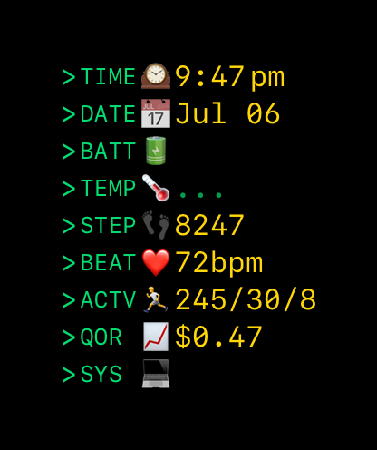

# OldSkool

A modern SwiftUI Apple Watch app that brings retro terminal vibes to your wrist.



## Overview

OldSkool displays system information, health metrics, weather, and more in a classic command-line interface style. Inspired by [TermiWatch](https://github.com/kuglee/TermiWatch), this app is built from the ground up using modern SwiftUI and native watchOS APIs.

## Features

- **Terminal Aesthetic**: Monospace fonts, green text on black background, hidden status bar for full immersion
- **9 Data Widgets**: Time, date, battery, weather, steps, heart rate, activity rings, stock prices, and system info
- **Modern Format**: Clean ">LABEL SYMBOL VALUE" display with 4-letter labels and Unicode symbols
- **Australian Stocks**: QOR.AX tracking (customizable)
- **Smart Fallbacks**: Shows "--" for unavailable data instead of errors
- **Modern APIs**: Built with SwiftUI, async/await, HealthKit, WeatherKit
- **No Dependencies**: 100% native Swift implementation
- **Series 7+ Optimized**: Takes advantage of larger screen real estate

## Requirements

- watchOS 11.5+
- Apple Watch Series 7 or later (optimized for 45mm)
- Xcode 15.0+

## Installation

1. Clone this repository
2. Open `OldSkool.xcodeproj` in Xcode
3. Build and run on your Apple Watch

## Widgets

The app displays information in a clean terminal-style format:

```
>TIME 🕒 3:14:15 PM
>DATE 📅 Jul 05, 2025  
>BATT 🔋 85%
>WTHR 🌤️ 22°C
>STEP 👟 8,247
>RATE ❤️ 68 bpm
>MOVE 🎯 Move: 245/400
>STKD 📈 QOR.AX: $8.42
>SYST ⚙️ watchOS 11.5
```

## Permissions

The app requests access to:
- **HealthKit**: For activity rings, step count, and heart rate data
- **Location**: For weather information via WeatherKit

## Development

Built with modern Swift patterns:
- SwiftUI for all user interfaces
- async/await for data fetching
- @StateObject and @ObservedObject for state management
- Native Apple frameworks (no third-party dependencies)

## Architecture

- **Protocol-based widgets**: Each data source implements `TerminalWidget`
- **Service layer**: Separate services for HealthKit, WeatherKit, and stock data
- **Consistent theming**: Centralized styling in `TerminalTheme`
- **Async data loading**: All data fetching uses modern async/await patterns

## Author

**Nick Conolly** - *Developer* - [GitHub](https://github.com/iamgaru)

## Credits

Inspired by [TermiWatch](https://github.com/kuglee/TermiWatch) by kuglee. OldSkool is a modern rewrite built with current SwiftUI and watchOS APIs.

## License

This project is licensed under the MIT License - see the [LICENSE](LICENSE) file for details.

Copyright (c) 2025 Nick Conolly